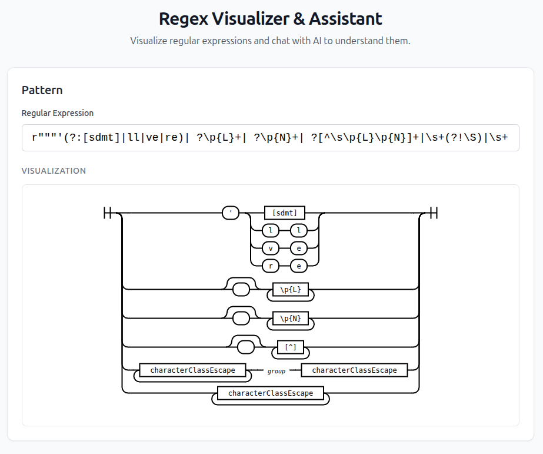
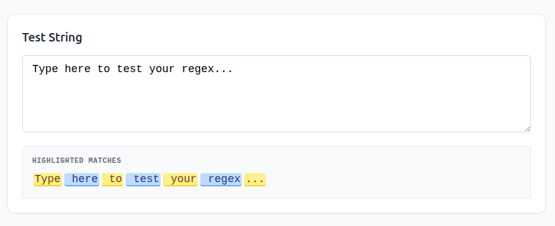

# Regex Visualizer & Assistant

A modern, interactive web application for visualizing Regular Expressions (Regex) and chatting with an AI assistant to understand, debug, and optimize your patterns.

**Regex pattern visualization:**


**Test string matching:**


**Chat with AI:**


## Features

- **Railroad Diagrams**: Instantly visualize your regex pattern as an easy-to-read railroad diagram.
- **AI Chat Assistant**: Ask questions about your regex in natural language.
  - "What does this part do?"
  - "How can I make this match email addresses?"
  - "Optimize this for performance."
- **Match Tester**: Test your regex against custom input strings with real-time, alternating color highlighting for clarity.
- **Python Regex Support**:
  - Handles Python raw strings (`r"..."`, `r"""..."""`).
  - Supports Unicode Property Escapes (`\p{L}`, `\p{N}`).
  - Visualizes Python-specific constructs like inline modifiers `(?i:...)` and possessive quantifiers `++`.
- **Markdown & Thought Process**: AI responses are formatted with Markdown, and internal "thought processes" (from reasoning models) are collapsible for a cleaner UI.

## Tech Stack

- **Frontend**:
  - React (Vite)
  - TypeScript
  - Tailwind CSS + Typography
  - `railroad-diagrams` & `regjsparser` (for visualization)
  - `react-markdown` (for AI chat rendering)
  - `axios` (for API requests)
- **Backend**:
  - Python (FastAPI)
  - OpenAI API (for chat intelligence)
  - `uvicorn` (server)

## Prerequisites

- **Node.js** (v16+) and **pnpm** (or npm/yarn)
- **Python** (v3.8+)
- **OpenAI API Key** or **local deployed service via vLLM**

## Getting Started

### 1. Clone the Repository

```bash
git clone https://github.com/alpha731/regex-visualizer.git
cd regex-visualizer
```

### 2. Backend Setup

Navigate to the `backend` directory, create a virtual environment, and install dependencies.

```bash
cd backend

# Create virtual environment
python -m venv .venv

# Activate virtual environment
# On macOS/Linux:
source .venv/bin/activate
# On Windows:
# .venv\Scripts\activate

# Install dependencies
pip install -r requirements.txt
```

Create a `.env` file in the `backend` folder with your OpenAI API key:

```env
OPENAI_API_KEY=your_api_key_here

# Optional: Set a specific model (defaults to gpt-3.5-turbo if not set)
# OPENAI_MODEL=gpt-4-turbo

# If you deploy a service using vLLM, set OPENAI_BASE_URL
# OPENAI_BASE_URL=<your local service url>
```

Start the backend server:

```bash
uvicorn main:app --reload
```
The server will start at `http://localhost:8000`.

### 3. Frontend Setup

Navigate to the `frontend` directory and install dependencies.

```bash
cd ../frontend
pnpm install
```

Start the development server:

```bash
pnpm dev
```
The application will be available at `http://localhost:5173`.

## Usage

1.  **Enter Regex**: Type or paste your regex pattern in the top input box.
    *   Try a complex one: `r"""(?i:[a-z]+)| \p{N}+"""`
2.  **Visualize**: Watch the railroad diagram update in real-time.
3.  **Test**: Scroll down to "Match Tester" and type some text to see what matches.
4.  **Chat**: Use the "AI Chat Assistant" at the bottom to ask for explanations or improvements.

## Project Structure

```
/
├── backend/
│   ├── main.py           # FastAPI application & endpoints
│   ├── requirements.txt  # Python dependencies
│   └── .env              # Environment variables (not committed)
├── frontend/
│   ├── src/
│   │   ├── components/   # React components (Chat, Visualizer, MatchTester...)
│   │   ├── utils/        # Helper functions (regex cleaning)
│   │   ├── App.tsx       # Main application layout
│   │   └── main.tsx      # Entry point
│   ├── package.json      # Frontend dependencies
│   └── tailwind.config.js
└── README.md
```

## Contributing

Contributions are welcome! Please feel free to submit a Pull Request.

## License

This project is open source and available under the [MIT License](LICENSE).
